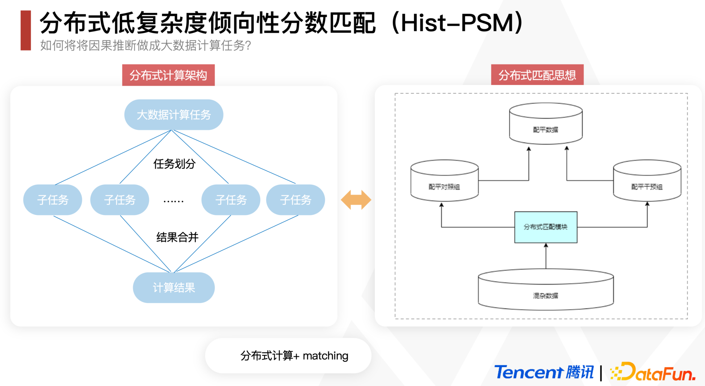
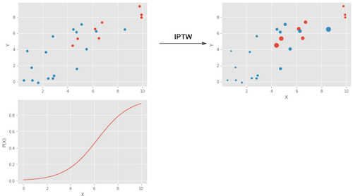
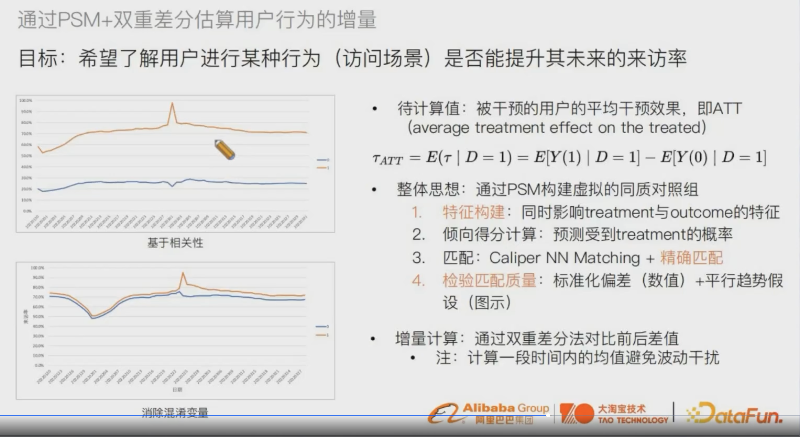
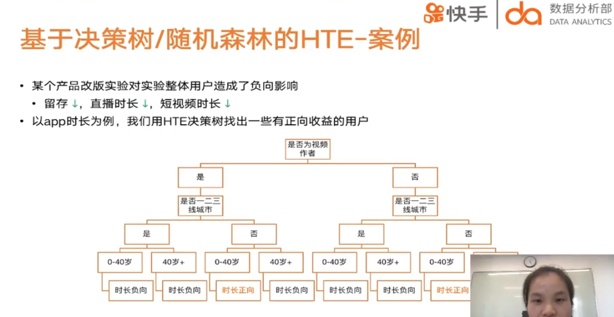
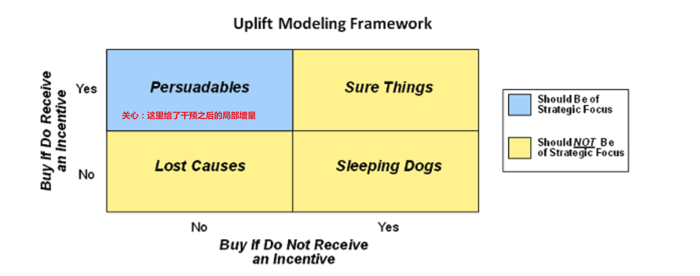
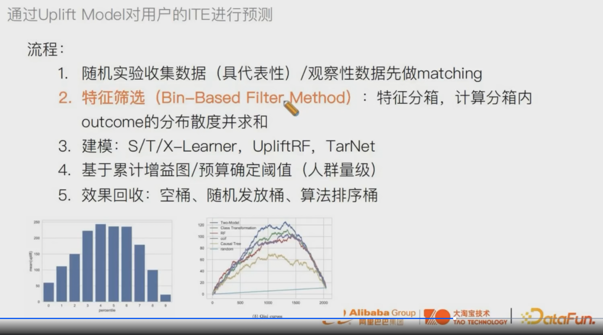
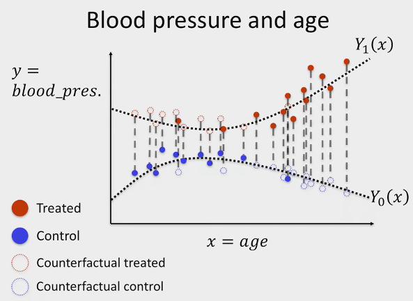
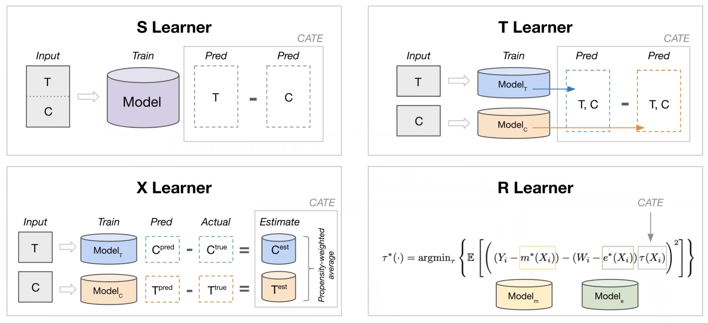
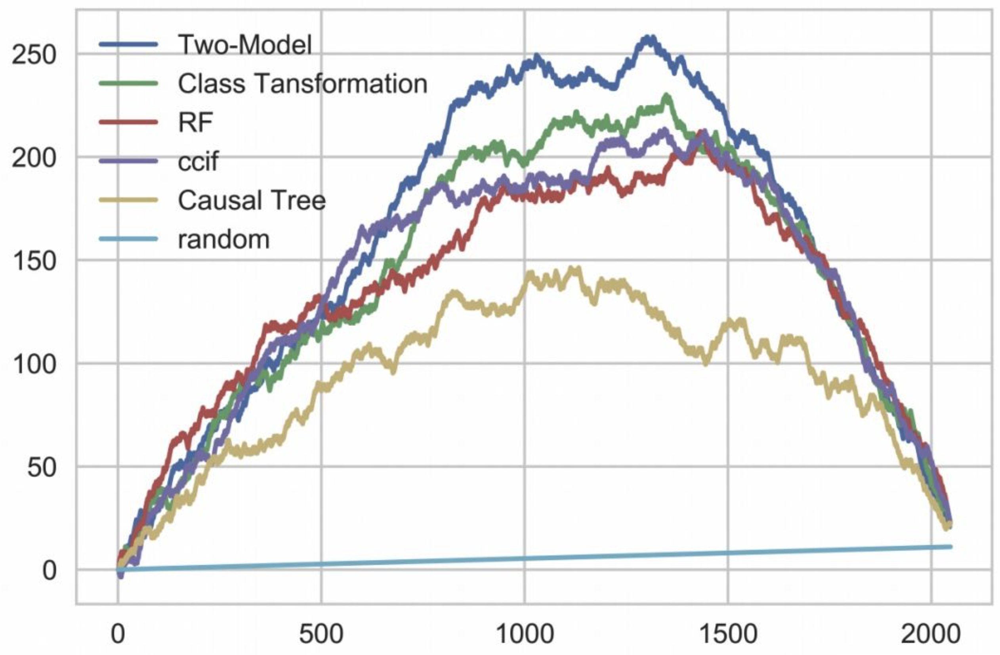

# 因果推理方法

总览
- 评估ATE常用方法：
    - Regression adjustment
    - 倾向性得分
        - PS matching
        - IPTW
    - 工具变量
        - 2SLS
        - deepIV
- 评估CATE常用方法：
    - uplift modeling 
    
        间接评估
        - meta learner
            - S / T / X / R learner

        直接评估
        - tree based
            - uplift tree / propensity tree / BART / upliftRF
        - deeplearning
            - BNN / TARNet / Perfect Match / CEVAE / DCN-PD / DragonNet
        - transformed outcome tree
    - tree based
        - Causal tree
        - Causal RF（Causal tree+RF）
        - Generalized RF（Causal RF tree+异质性最大分裂等）
            - CausalForestDML (Generalized RF+Global DMB)
            - Orthonal RF (Generalized RF+局部Neyman正交)
- Continuous Treatment Effect
    - 双重差分
    - generative model
    - entropy balancing
- Time-varing Treatment Effect
    - Well-defined regression
    - Deep Learning

AB跟因果推断的关系
- 解决同一个问题
- AB更准，因为用户看不到新功能 理论上来讲不相互影响的概率更高，因果推断是依赖各种假设

## Propensity Score


调整每个unit的权重，使得treatment组合和对照组的分布一致，解决选择偏差的问题，提高两组用户的可比性。

- 例子：由于用户是否受到广告曝光, 还会由其他的混淆变量影响 (性别、年龄、产品搜索活跃度...) 因此引入倾向性评分。

### 确定研究问题

X、T、y都是谁
- X：
    - 用户静态画像（年龄、性别、城市等级）
    - 用户动态行为：
        - 过去X天使用时长
        - 消费量等
        - 用户关注的人
- T
    - 业务条件 比如是否领券、是否签到等
- Y
    - 核心变量：如GMV、未来7日内日均使用时长


### 倾向性评分计算
倾向性评分Propensity Score： 用于评估实验组和对照组的用户最终是否收到广告曝光的可能性大小。


实现倾向性评分的方式有很多, 这里以逻辑回归为例。
我们以**是否接受实验*作为应变量, 自变量则为混淆因子, 建立逻辑回归关系。

$\mathbf{e}=\mathrm{P}($ Treatement<是否广告曝光>|搜索活跃度、性别年龄...)

- 各样本点的倾向性得分即为逻辑回归模型获得的概率值ei。

也可以套用其他更复杂的模型，如LR + LightGBM、NN等模型估算倾向性得分。


### 倾向性得分匹配

这个步骤的核心是利用propensity score来拉齐实验组和对照组的分布，从而实现对Selection bias的修正
- 意义：若一个接受广告曝光的用户和无曝光的用户获得相似的倾向性评分, 则说明我们保持了混淆变量的影响力基本一致, 而唯一影响产品呢关键词搜索的变量则是广告曝光本身。这样就可以假装我们做了一个 A/B Test 了

#### 匹配策略
匹配对照组用户用的方法：
- Exact matching：
    最基本款的 Matching 是 Exact Matching。假设我们感兴趣的因果效应是 ATT：
    - 对于每一个 T=1的用户，我们从 T=0的分组里找一个 pre-treatment变量 X一模一样的用户把他们配成对，找不到就放弃。
    - 配对过程结束后，一部分或者全部 T=1的用户找到了平行世界的自己，我们直接比较两组用户观察结果YY的差异就可以得到结论。
- Exact Matching 的一个直观变种是 Distance Matching，科学有效地进行 Matching，一个经典的做法是 Propensity Score Matching
- greedy search
- KNN: 进行1对K有放回或无放回匹配
- 分桶法：先对实验组分桶，然后对每一个实验组进行遍历，找到ps分桶值相同的对照组作为新对照组集合中的元素。
- Caliper：使用得分差异上限（caliper）匹配用户时，我们要求每一对用户的得分差异不超过指定的caliper 比如0.005都选中。但“强扭的瓜不甜”，对没匹配的部分实验组用户是舍弃discard！


#### 其他匹配方法

腾讯游戏在DataFun 2022的分享中提到了一个时间复杂度大大下降的Hist-PSM，其实就是group by比如*100取整的PS实现分桶，再每组抽等量个体做matching，整体流程：
<center></center>

而这套流程是可以分布式地跑在Spark里的：
<center></center>

### positivity检查

要看T=0和T=1的propensity score是否有比较多的overlap，如果很少、propensity score都是离群的，则要检查positivity的假设是否被违反了
> - 例：有一些特征的群体 比如15岁以下 就是一定会T=1（比如领券），而T=0没有施加的概率

- If a treated has a propensity score of, say, 0.9 and the maximum propensity score of the untreated is 0.7, we won’t have any untreated to compare to the individual with the 0.9 propensity score. 

- This lack of balancing can generate some bias, because we will have to extrapolate the treatment effect to unknown regions. 

- Not only that, entities with very high or very low propensity scores have a very high weight, which increases variance. As a general rule of thumb, you are in trouble if any weight is higher than 20 (which happens with an untreated with propensity score of 0.95 or a treated with a propensity score of 0.05).


### 平衡性检查
我们需要检查最后挑选出的“对照组"在各类混淆变量的分布是否与实验组近似！
衡量配平效果:
- 整体——看Control和Treatment两个组中的倾向性得分分布——匹配之前 vs 匹配之后
- 特征——看Standarized Mean Difference(SMD)=组间均值柴油 / 合并标准差，来判断匹配后 样本pair是否足够相似

    也可以比较匹配前后
    - SMD $<0.1$ 说明该特征组间协变量差异较小
    - SMD > 0.1但特征较为稀疏且业务意义不大的，可以适当放宽
        - 重要特征超过0.1则需要重新处理


    ```python
    def smd (feature, treatment):
        t = feature[treatment =1]
        c = feature[treatment ==0]
        return abs(t.mean () -c.mean()) / np.sqrt(0.5 * (t.var() + c.var()))
    ```
- 看特征在匹配前后的 QQ-Plot。
  
    QQ图(Quantile-Quantile plot)是以实验组和对照组的特征匹配分位数后作为横坐标和纵坐标画图。散点越接近对角线说明两组数据越接近。左边All为匹配前的QQ plot，右边Matched为匹配后的QQ图，可以看到匹配前后，散点更加接近对角线，说明数据的分布明显接近。

    <center></center>


### 因果效应推断

#### 直接推断
匹配后，从匹配后的两组用户中得到因果效应，推断实验组的平均干预效应 ATT (Average Treatment Effect on the Treated)，可以直接比较匹配后的实验组和对照组，也可拟合一个由干预和用户特征预测观察结果的线形模型，看看干预T的系数是多少。

ATE的话：

$A \widehat{T} E=E\left[Y_{1}\right]-E\left[\hat{Y}_{0}\right]=\frac{1}{n} \sum_{i=1}^{n}\left[\frac{T_{i} \cdot Y_{i}}{e\left(X_{i}\right)}-\frac{\left(1-T_{i}\right) \cdot Y_{i}}{1-e\left(X_{i}\right)}\right]$

#### 逆概率加权处理方法IPW
为了消除样本点中的选择倾向，可以将样本点对应的Y值用PSM分值归一化，称为Inverse Probability of Treątment Weighting(IPW)。
加权的方式如下：其中$P(x)$代表$x$算出的倾向得分, Z代表该样本是否接收干预。
$$
w=Z / P(x)+(1-Z) /(1-P(x))
$$
- 其实就是1/那个outcome的propensity

$$
E[Y|X,T=1]−E[Y|X,T=0] = E\bigg[\dfrac{Y}{P(x)}|X,T=1\bigg]P(x) - E\bigg[\dfrac{Y}{(1-P(x))}|X,T=0\bigg](1-P(x))
$$
- 跟之前的直接相减比，现在是赋予了权重，这个权重不是被treat的比例，而是probability of receiving treatment，所以管它叫inverse！
  
- 重新跟样本中的用户加权，给不合理分组用户高的权重，让它在不合适的组中的声音变大，从而实验组和实验组中呈现等概率
    <center></center>
    
    > 一个 倾向分就是x越大越高的例子⬆

    - T=1组倾向分低的提高权重: If someone has a low probability of treatment, that individual looks like the untreated. However, that same individual was treated. This must be interesting. We have a treated that looks like the untreated, so we will **give that entity a high weight.**
    - T=0组倾向分高的提高权重
- IPTW方法的优点是可以不损失样本量


### 敏感度分析

分析混淆变量的选择等主观的一些分析是否会得到一致的分析结论，敏感性分析主要的目标是衡量当混淆变量（特征）不满足非混淆假设（unconfoundedness ）时，分析结论是不是稳健的。简单的做法是去掉一个或者多个混淆变量重复上面的过程：

尝试若干refutation方法进行敏感性分析 判断模型是否robust and 结果可靠
- Placebo [替换treatment为独立随机变量]： 理论接近O
- Random Cause[增加独立随机变量]：理论无影响
- Subset Data [使用部分数据]：理论无影响
- Random Replace [随机替换自变量]：理论无影响


## 双重机器学习

双重机器学习 (Double Machine Learning, DML):  同时产生指标和treatment的估计，并利用估计量与观测值之间的残差拟合CATE的估计量。产生指标和treatment的估计的过程中可以利用任意Machine Learning的方法，由此称为Double Machine Learning (DML)。

假设:
- CIA假设：所有的混淆变量都可以被观测


方法核心：通过减去拟合的W实现了de-confounder


- 第一步是建两个非参的模型（W表示一个高维的控制变量）:
    1. Fit a model to predict $Y$ from $W$ to get the predicted $\hat{Y}$——拟合$q(X, W)= E[Y|X, W]$
    2. Fit a model to predict $T$ from $W$ to get the to get the predicted $\hat{T}$——拟合$f(X, W)= E[T|X, W]$

- 第二步计算Y和T的估计残差, "partial out" $W$ by looking at $Y-\hat{Y}$ and $T-\hat{T}$

    - $\tilde{Y}=Y-\hat{Y}=Y-q(X, W)$
    
        $\tilde{T}=T-\hat{T}=T-f(X, W)$

- 第三把两个残差回归
    $\tilde{Y}=\theta(X) \cdot \tilde{T}+\epsilon$
     - 结果：deconfounded the effect of treatment on the outcome with this partialling out，最后得到的就是causal effect estimates
    - cross-fitting: 这个过程的具体操作为了保证无偏估计并克服过拟合，可以将训练集分成 $K$ 份, 每一份都是“一份训练残差, 其余估计 $\theta(X)^{\text {”, }}$ 最后取 $K$ 份的平均 $\theta(X)$ 作为最终 $\theta(X)$ 。

DML特点:
1. 适合个体特征/控制变量维度高的场景;
    - 多维Treatment(W)案例：福利发放的干预策略=金额+时间间隔共同组成，比如每隔T秒发放金额为M的红包
2. 框架服从Heyman正交，理论上是无偏估计;
3. 参数以 $\sqrt{N}$ 速率收敛，简单高效，实用性强;
4. 无法捕捉到复杂的非线性 $\theta(X)^{\prime}$ 。
    - 还是上面红包的例子，如果直接训练DML，相当于我们假设T和M之间是独立的，模型学不到两者的互补信息，比如有的用户喜欢间隔短一点但金额可以少一点的高频刺激，有的用户则相反。
    - 解决：
        - 连续变量——借助交叉升维得到多项式扩展（类似于FM的思路）：把$\{T_{1}, T_{2}\}$变成
        
            $$
            \left\{T_{1}, T_{2}, T_{1} \cdot T_{2}, T_{1}^{2}, T_{2}^{2}, T_{1}^{2} \cdot T_{2}^{2}\right\} \in \mathbb{R}^{6}
            $$
        
        - categorical——one-hot之后再用propensity score多分类预测

        - 多 T假设为相互独立, 最后建立回归模型拟合 $E(\mathrm{T|X})$


案例：
- 快手直播
    <center></center>
    
    - D：直播推荐多样性｜Y：用户活跃度｜X：用户画像（自身+看播表现）
    - 想看D对Y的影响(Y)的影响，但D和Y都被非常高维的X confound了


## 双稳健模型

> [Doubly Robust Estimation of Causal Effects](https://www.ncbi.nlm.nih.gov/pmc/articles/PMC3070495/pdf/kwq439.pdf)

双稳健模型 (Double Robust, DR):  DML方法在针对categorical的treatment时的优化版本。此方法实际上利用了Inverse Propensity Score和Direct Method，以此修正前者产生的过大方差和后者导致的有偏估计。因此对两方法同时robust，故称Doubly Robust (DR)。


好处：
- IPW需要样本权重主要围绕倾向的分为核心，倾向得分一旦预测不准，会导致上面的估计方法出现很大的偏差。双重稳健估计（doubly robust estimation）是这对这一问题提出的更为稳健的方法，该模型结合了针对结局的回归模型和针对处理的倾向性评分模型，从而得到一个具有双重稳健性的效应估计量，即——**只要outcome regression模型和倾向性评分模型中有一个正确（consistent），就能保证估计量的一致性和无偏。**
- 熟练的会比

缺点：it’s very hard to model precisely either of those. More often, what ends up happening is that neither the propensity score nor the outcome model are 100% correct. They are both wrong, but in different ways. When this happens, it is not exactly settled if it’s better to use a single model or doubly robust estimation.

这个方法需要根据已有数据，再学习一个预测的模型，反事实评估某个个体在干预变量变化后，结果变量的期望值。 只要倾向指数的估计模型和反事实预测模型中有一个是对的，计算出的平均因果效应就是无偏的； 但如果两个模型估计都是错误的，那产生的误差可能会非常大。
- 反事实预测模型出错的原因：业务中可能无法覆盖全部的混淆因子

DR与DML类似，也有多个建模的中间步骤，
- 相同点： 第一阶段也是使用ML模型估计倾向性得分和目标变量Y；第二阶段进行因果效应评估。
- 不同点： 在于第一阶段估计目标变量Y时，同时使用X和Treatment作为特征。
    - 读原始论文的意思，这里的X是confounder的合集！这就是为啥我们能用LR来估ATE（通常这个X是未知/过于高维的）


### 估计方式
$$
\hat{ATE} = \frac{1}{N}\sum \bigg( \dfrac{T_i(Y_i - \hat{\mu_1}(X_i))}{\hat{P}(X_i)} + \hat{\mu_1}(X_i) \bigg) - \frac{1}{N}\sum \bigg( \dfrac{(1-T_i)(Y_i - \hat{\mu_0}(X_i))}{1-\hat{P}(X_i)} + \hat{\mu_0}(X_i) \bigg)
$$

- $\hat{P}(x)$: 对有$x$这组数据被分到T=1的倾向性评分的估计(比如 用logisticssuan)
- $\hat{\mu_1}(x)$: 对$E[Y|X, T=1]$的估计(比如，对T=1的直接Y和confounder X们线性回归然后取intercept）
    $\hat{\mu_0}(x)$: 对$E[Y|X, T=0]$的估计

解读为什么it only requires one of the models, $\hat{P}(x)$ or $\hat{\mu}(x)$, to be correctly specified
- 公式前半部分是$\hat{E}[Y_1] = \frac{1}{N}\sum \bigg( \dfrac{T_i(Y_i - \hat{\mu_1}(X_i))}{\hat{P}(X_i)} + \hat{\mu_1}(X_i) \bigg)$

    - Assume that $\hat{\mu_1}(x)$ is correct. If the propensity score model is wrong, we wouldn't need to worry because:
        - if $\hat{\mu_1}(x)$ is correct, then $E[T_i(Y_i - \hat{\mu_1}(X_i))]=0$. That is because the multiplication by $T_i$ selects only the treated and the residual of $\hat{\mu_1}$ on the treated have, by definition, mean zero. This causes the whole thing to reduce to $\hat{\mu_1}(X_i)$, which is correctly estimated $E[Y_1]$ by assumption. 
        - So, you see, that by being correct, $\hat{\mu_1}(X_i)$ wipes out the relevance of the propensity score model. We can apply the same reasoning to understand the estimator of $E[Y_0]$. 
    - Assume that $\hat{\mu_1}(x)$ is wrong but the propensity score model is correct:

        - rearrange some terms:
            $$\begin{aligned} 
            \hat{E}[Y_1] &= \frac{1}{N}\sum \bigg( \dfrac{T_i(Y_i - \hat{\mu_1}(X_i))}{\hat{P}(X_i)} + \hat{\mu_1}(X_i) \bigg) \\ 
            &= \frac{1}{N}\sum \bigg( \dfrac{T_iY_i}{\hat{P}(X_i)} - \dfrac{T_i\hat{\mu_1}(X_i)}{\hat{P}(X_i)} + \hat{\mu_1}(X_i) \bigg) \\
            &= \frac{1}{N}\sum \bigg( \dfrac{T_iY_i}{\hat{P}(X_i)} - \bigg(\dfrac{T_i}{\hat{P}(X_i)} - 1\bigg) \hat{\mu_1}(X_i) \bigg) \\
            &= \frac{1}{N}\sum \bigg( \dfrac{T_iY_i}{\hat{P}(X_i)} - \bigg(\dfrac{T_i - \hat{P}(X_i)}{\hat{P}(X_i)}\bigg) \hat{\mu_1}(X_i) \bigg)
            \end{aligned}$$
        - Propensity score正确，所以$E[T_i - \hat{P}(X_i)]=0$, which wipes out the part dependent on $\hat{\mu_1}(X_i)$. This makes the doubly robust estimator reduce to the propensity score weighting estimator $\frac{T_iY_i}{\hat{P}(X_i)}$, which is correct by assumption. 
        - So, even if the $\hat{\mu_1}(X_i)$ is wrong, the estimator will still be correct, provided that the propensity score is correctly specified.

         


- second part estimates $E[Y_0]$.


代码：
```python
def doubly_robust(df, X, T, Y):
    ps = LogisticRegression(C=1e6, max_iter=1000).fit(df[X], df[T]).predict_proba(df[X])[:, 1]
    mu0 = LinearRegression().fit(df.query(f"{T}==0")[X], df.query(f"{T}==0")[Y]).predict(df[X])
    mu1 = LinearRegression().fit(df.query(f"{T}==1")[X], df.query(f"{T}==1")[Y]).predict(df[X])
    return (
        np.mean(df[T]*(df[Y] - mu1)/ps + mu1) -
        np.mean((1-df[T])*(df[Y] - mu0)/(1-ps) + mu0)
    )
T = 'intervention'
Y = 'achievement_score'
X = data_with_categ.columns.drop(['schoolid', T, Y])
doubly_robust(data_with_categ, X, T, Y)
```

### 包的实现

- [EconML](https://github.com/microsoft/EconML/blob/main/notebooks/Doubly%20Robust%20Learner%20and%20Interpretability.ipynb)

### 一些魔改

腾讯游戏在2022 DataFun 数据科学峰会里提到了一个Binary DR，就是把二元的outcome变量（是否留存）先用$g(x) = log(1 - \frac{1}{x})$ 映射成连续变量（多少天后留存），估计完之后再用sigmoid换回来，效果据说比UBER表现最好的算法UBER-X-Learner还好很多：

<center></center>

## DID

通过寻找两个表现差异基 本稳定一致的群体, 对其 中一组先不干预后干预, 观察组间差异值的前右变 化
|  | 干预前 | 干预后 | 差异 |
| :--- | :--- | :--- | :--- |
| 干预组 | A1 | A2 | A2-A1 |
| 对照组 | B1 | B2 | B2-B1 |

- 实验前: 实验组与对照组满足平行趋势假设
- 实验：在实验组中先不干预后干预, 观察试验组对照组的差异在实验前后的变化
- 实验后计算收益: Gain=(A2-A1)-(B2-B1)

### 假设

干预发生前的 Treatment和control两组符合平行趋势：对结果有干扰的效应随着时间不会变化
- check方法：可以画个时间序列图然后mark两者gap大小的置信区间，看0是不是一直在区间里。


#### 模型setup

是否有t的01变量+前后两个时间段的面板数据+不可观测的个体固定效应：

$$Y_{i t}=a_{i}+\lambda_{\mathrm{t}}+D_{i t} \beta+\varepsilon_{i t}$$
- 这里的$a$只跟$i$有关而跟$t$无关！

可以借助差分来消除固定效应，从而得到
$$\beta=\left(\bar{Y}_{\text {post }}^{\text {treat }}-\bar{Y}_{\text {pre }}^{\text {treat }}\right)-\left(\bar{Y}_{\text {post }}^{\text {control }}-\bar{Y}_{\text {pre }}^{\text {control }}\right)$$

### 问题

并不适用于所有实验,也就是要求t0到t1之间，两群人的活跃时长变化趋势是一样的

### 跟PSM的结合使用
<center></center>

> 来源：[DataFun 2022电商零售与数据科学论坛｜电商场景下的有效干预策略实践 by 阿里大淘宝技术](https://appukvkryx45804.pc.xiaoe-tech.com/detail/l_627da1d3e4b0cedf38b11d22/4)

- 如果单纯用DID的话 对照组之前可能不太符合同质化，所以先用PSM构造虚拟对照组再did会更精准
- 算PS的时候要注意特征的构建，要尽量囊括confounder
- 匹配的时候是先用了Caliper NN Matching（有边界最近邻匹配），然后再在一些重要的特征上做精读的提升（比如T是手淘里面加入斗地主功能，男女差异很大，所以只在男性和男性以及女性和女性之间做匹配）
- 要注意观测一定的时间：有的Treatment可能会长时间带来影响，有的可能只是短期

<center></center>
- 注意结论的进一步下钻，我们知道男性在斗地主之后购买下降，那么下降在哪呢？——发现是户外活动类的比如门票

## 树方法


异质性（Heterogeneity）：

- 遗传学：一种遗传性状可以由多个不同的遗传物质改变所引起。
- 一个变量X对另一个变量Y的影响可能因个体而异
- 因果推断：由于存在未被观测到的异质性，即使在所有可以被观测到的方面都相同的人们仍然会做出不同的决策、获得不同的收入 、选择不同的投资组合缺。

### 因果树

目的：了解策略对于不同用户的异质性影响，最后每群人可以得到一个Estimated的treatment effect，从而可以圈选出敏感用户群体并研究他们的特征；

例子：比如研究改版后哪些用户群体用快手的时间更长了（如果一平均可能没多少！），从而可以针对性对敏感用户进行改版实验！
- <center></center>

#### Honest Tree/Double-SampleTrees

将训练样本分成两份
- 训练集$\mathbf{S}^{t r}$：一份用来先训练普通 CART 树(特征为 $\mathbf{X}$, 输出为 $\mathbf{Y}$ )，把相似的个体放到一个叶节点
- 估计集$\mathbf{S}^{est}$：另一份根据训练好的 CART 树直接评估 CATE, 评估式为
        $$
        \hat{\tau}(x)=\frac{1}{\left|\left\{i: T_{i}=1, X_{i} \in L\right\}\right|} \sum_{\left\{i: T_{i}=1, X_{i} \in L\right\}} Y_{i}-\frac{1}{\left|\left\{i: T_{i}=0, X_{i} \in L\right\}\right|} \sum_{\left\{i: T_{i}=0, X_{i} \in L\right\}} Y_{i}
        $$
    - $L$ 表示树的叶子节点。

具体算法：

- 在每一个叶子结点上：对每一个特征排序：在各种分裂方式中找到
- 在估计集中估计各个节点的因果效应和方差

跟决策树的区别
- focus on estimating conditional average treatment effects rather than predicting outcomes. （原因是我们现在没有ITE）
- separation between constructing the partition and estimating effects within leaves of the partition, using separate samples for the two tasks, in what we refer to as honest estimation


#### Propensity Trees
直接训练普通 CART 树(特征为 $\mathbf{X}$, 输出为 $\mathbf{T}$ ), 然后套用上式评估CATE。

目标：从协变量中，找到一个最优分裂节点，最大化子节点间处理效应差异。

因果树：使得每个组中都有实验组个体与对照组个体，因此每个分组都构成了一个人为构造的实验，可以直接计算出处理效应。
- 在构造因果树的时候要保证组内的个体要尽可能相似，而不同组之间的处理效应的差异要尽可能大。最终，组内平均处理效应就是该组个体的处理效应的预测值。
- 经典决策树和因果决策树的区别在于前者为结果变量，后者为处理效应（ATE或者CATE）。

首先使用决策树进行分组，进而对于每一个叶子内部，将处理组平均减去对照组平均，就得到了处理效应。

#### 具体实现

- causalML的uplift tree和econml的causal tree/forest都能用于寻找对处理敏感的局部人群，但算法不同（都是基于决策树，但树的分裂规则不同）
- causalML的uplifttreeclassifier系列默认y是binary outcome，把evaluationFunction参数设为'CTS'即可用来处理continuous的y。也有causaltree

### 因果森林

Causal Trees + 随机森林 = Causal Random Forest

- 使用森林的原因：因果推断无ground truth对比，衡量树模型的效果是很困难的事情。通常我们会担心overfitting、stability的问题，用forest比用单棵树能获得更好的稳定性。

### Generalized Random Forest(GRF)
广义随机森林可以看作是对随机森林进行了推广：原来随机森林只能估计观测目标值 $Y$, 现在广 义随机森林可以估计任何感兴趣的指标 $\theta(\cdot)$ 。

- 异质性最大化分裂准则:

    给定样本 $J, P$ 表示父节点, $C_{1}$ 和 $C_{2}$ 表示两个子节点, $N$ 表示样本数, 异质性最大化准则为

    $$
    \Delta\left(C_{1}, C_{2}\right):=\frac{n_{C_{1}} \cdot n_{C_{2}}}{n_{P}^{2}}\left(\hat{\theta}_{C_{1}}(\mathcal{J}) - \hat{\theta}_{C_{2}}(\mathcal{J})\right)^{2}
    $$

    - $\frac{n_{C_{1}} \cdot n_{C_{2}}}{n_{P}^{2}}$: 哟昂来确保两个子节点的样本尽量均衡
    - 后者：MSE最小化目标函数来估计

确保两个子节点样本尽量均衡 由MSE最小化目标函数估计

### Causal Forest DML
先对训练数据做DML双阶段估计先拟合 $E[Y \mid X], E[W \mid X]$, 得到残差

再将残差项给到CF训练, 从而融合两者的优势。

EconML已实现

#### Orthogonal Random Forest(ORF)


可以看做GRF的正交化版本：
- 继承了GRF的所有优点。
- 将DML的思想融入了每一次节点分裂当中：每一次分裂都会有双阶段估计，可以学习到非常复杂的非线性θ(X)

ORF特点:
1. 可以学习更复杂的非线性 $\theta(X)$;
2. 局部正交进一步保证了分裂的因果性;
3. 支持连续干预, 并对离散干预加入DR评估。


## Uplift增益模型

传统预测模型会预测$P(Y=1 \mid T=1)$(有激励下用户正向反馈的概率)，而Uplift评估T对Y=1的概率的增益，也就是$P(Y=1 \mid X, \boldsymbol{T})$ - $P(Y=1 \mid X)$
- 因为ITE反事实，所以通常用CATE｜但uplift这里可以帮助我们预估回ITE

uplift模型跟response模型的区别：
- Response Model: $P(Y=1 \mid X)$：用户购买概率，只刻画了画像和购买的相关性，没有考虑反事实

- Uplift Model: $P(Y=1 \mid X, T)$：因为某种干预后用户购买概率，也就是T产生的的增量效果，它的理论基础就是因果推断。

  > 举例：找到能通过激励达到提升**次日留存率最大**的10w个用户

意义：营销场景中我们都希望每次的投入能达到最大的转化，即把活动福利用在真正需要的用户身上，即找到对于活动敏感的人群进行干预/激励。按照是否给干预和是否能带来正向反馈对人群进行分类：

<center></center>

- 敏感人群：干预/给了激励后（不发券就不购买、发券才会购买的人群），效果向正向转变的人群；

- 自然转化人群：即使不给激励（无论是否发券，都会购买），也是正向效果的人群；

- 不敏感人群：给不给激励都不起效果的人群；

- 反作用人群：对营销活动比较反感，不发券的时候会有购买行为，但发券后不购买，可能是干预反感人群。

如果用单纯的单ML/DL模型按照预估的购买率来发券的话，其实不是最优的因为可能里面有自然转化人群，我们其实发到敏感人群上作用才比较大！

### 特征筛选trick
<center></center>

> 来源：[DataFun 2022电商零售与数据科学论坛｜电商场景下的有效干预策略实践 by 阿里大淘宝技术](https://appukvkryx45804.pc.xiaoe-tech.com/detail/l_627da1d3e4b0cedf38b11d22/4)

- 特征筛选的时候判断重要性：
    - 先把特征分成若干个箱，比如年龄分0-10、10-20 ···
    - 对[20, 30]组内的用户 计算T=0 T=1 outcome的分布的散度
    - 再把各个组的散度sum起来，就得到了年龄的特征重要性
- 可以根据特征重要性进行特征筛选

### Meta-Learning方法

比如：对于每个年龄是$x_{i}$的用户i来说，只能接受治疗观察到$Y_{1}\left(X_{i}\right)$ 或者 $Y_{0}\left(X_{i}\right)$ ，所以没法跟反事实做差，但同样的x我们可以去预测反事实的结果



Meta learning就是解决这样问题的间接估计方法：它不直接对treatment effect进行建模，而是通过对response effect（target）进行建模，用T带来的target变化作为HTE的估计

- 优点：
  - 可以直接用监督学习的方法直接建模而不需要重新构造模型, 而且实现起来比较快。
  - 可以了解策略对于不同用户的异质性影响（比如做uplift score在年龄维度上的弹性实验）

- 缺点：因为是间接建模, 它的误差在一些场景下 比较大。

<center></center>


#### S-Learner

Single learner把用户是否受干预 (T) 作为特征一起加入到模型构建中:

- 模型估计: $\hat{\mu}=M(Y \sim(X, T))$
    - 输入：对于样本 有自己的X 加上T
    - 预测：对实验组用户(T=1)可以预测他们X相同但是T=0下的值，同样对于对照组也可以预测T=1，这样通过反事实
    - 对比真实的观测数据就可以得到 对于同样一个x，它在T-1的结果和T=0的结果——CATE
- 把 $\mathrm{T}=1$ 和 $\mathrm{T}=0$ 分别代入预测, 差分计算增量: $\hat{\tau}(x)=\hat{\mu}(x, T=1)-\hat{\mu}(x, T=0)$

特点：这种建模方式在训练的时候相比T-learner用了更多的样本数据进行学习，在面对多类型干预的情况下（如干预金额大小不一样）, 也可以直接进行建模。

#### T-Learner

> Intuition：用户受干预和不受干预时，因变量的分布是不一样的，甚至取值范围都可能不一样，所以应该分别建模

Two-learner基于两个样本群体（有干预群体和无干预群体）分别建立响应模型，对预测组的用户，分别使用两个模型进行预测，对预测结果进行差分，这个差分值就是干预的提升量（uplift score）：

- control组样本建模: $\hat{\mu_{0}}=M_{1}\left(Y^{0} \sim X^{0}\right)$
- treatment组样本建模：$\hat{\mu_{1}}=M_{2}\left(Y^{1} \sim X^{1}\right)$
- 预测+差分⇒增量：$\hat{\tau}(x)=\hat{\mu_{1}}(x)-\hat{\mu_{0}}(x)$

这种建模方式可以快速实现获取到用户因为干预带来的提升量，通过对干预的提升量（uplift score）进行从高到低排序来决定是否对用户进行干预。相比于S learner的优势在于，我们能够引入不同的学习器来针对不同的潜在结果进行评估，从而有可能能得到更好的估计。

特点：可能bias在两边方向不同，比如估T=1用户的时候Y=1估大了，估T=0用户的时候Y=1估小了，这个时候算CATE相减的时候都贡献了bias（S-Learner因为bias的方向一样 所以相减的时候不会有这个问题）


#### X-Learner

四个学习器，解决bias的问题，基于T-learner构建的双模型上，预测用户的反事实推断。


具体过程：

<center></center>

公式：

- Step1: 构建T-learner双模型对outcome建模

    可以是传统的机器学习模型如svm，lr，xgboost等，也可以是神经网络

    - 模型1——无干预样本建模: $\hat{\mu_{0}}=M_{1}\left(Y^{0} \sim X^{0}\right)$
    - 模型2——有干预样本建模: $\hat{\mu_{1}}=M_{2}\left(Y^{1} \sim X^{1}\right)$

- Step2: 预测用户的反事实推断，并差分计算提升值也就是pseudo-effects:

    这里跟T-Learner不一样的是 我们使用真实的数据点与反事实推断的预测值的差值

    - T=0的用户 预测T=1的反事实结果-真实: $\hat{D^{0}}=\hat{\mu_{1}}\left(X^{0}\right)-Y^{0}$
    - T=1的用户 真实-预测T=0的反事实结果: $\hat{D^{1}}=Y^{1}-\hat{\mu_{0}}\left(X^{1}\right)$

- Step3: 把**提升值**(原文叫imputed treatment effects)作为模型的新label重新建模，这里相当于两遍分别继续学习T- Learner两个模型的残差项。如果第二步效果好的话这里的 $\hat{\tau_{0}}$ 会跟$\hat{D^{0}}$很接近 因为本质上$\tau_{i}(x)=E[\tilde{D} i \mid X=x]$
    - 模型3——无干预样本建模: $\hat{\tau_{0}}=M_{3}\left(\hat{D^{0}} \sim X^{0}\right)$
    - 模型4——有干预样本建模: $\hat{\tau_{1}}=M_{4}\left(\hat{D^{1}} \sim X^{1}\right)$

- Step4: PSM加权得到最终的uplift: $\hat{\tau}(x)=p(x) \hat{\tau_{0}}(x)+(1-p(x)) \hat{\tau_{1}}(x)$

    - 这里模型3得到的uplift是两个：一个是对T=0的用户建模的结果，一个是对T=1用户建模的结果，
    - 角度一：treat数据量很少的时候会容易欠拟合，这个时候大家ps都很低（ps可以认为是在样本数据集中 $\mathrm{T}=1$ 的比例附近的），那么就会抬升这个用户在被treat的情况下的uplift，从而让treat调成一个伪随机
    - 角度二：对于ps高的个体，说明更接近T=1，而M3其实是用T=1的数据去训练的response model，所以用T=1的更准（多用response model的训练part少用测试part）

额外注意点：
- 额外引入propensity score，会引入新的误差
- 注意计算效率，不一定是比T-Learner好的

#### R-Learner

R Learner 借用正交的概念来消除选择性偏差(之前怎么选择30%和70%的划分方式会影响模型的)
- 两段式建模
    - Cross-validation [一般5-10Tfolders] 得到目标效应的预估 $\hat{m}(x)$ 和样本倾向分 $\hat{e}(x)$
    - 相比于优化 $T=1$ 和 $T=$ 情况的残差，这边提出一个R loss的function:
        $$
        \hat{L}_{n}(\tau(x))=\frac{1}{n} \sum_{i=1}^{n}\left(\left(Y_{i}-\hat{m}^{(-i)}\left(X_{i}\right)\right)-\left(W_{i}-\hat{e}^{(-i)}\left(X_{i}\right)\right) \tau\left(X_{i}\right)\right)^{2}
        $$
        - $\widehat{m}^{(-i)}\left(X_{i}\right)$ 是除ith样本外得到的预估值, $Y_{i}$ 是真实值; $W_{i}$:观测数据中的Treatment真实值
        - 前面是机器学习常规的二项残差，后面带有一个惩罚项 [类似正则], $\tau\left(X_{i}\right)=Y\left(W=1 \mid X_{i}\right)-Y(W=$ $\left.0 \mid X_{i}\right)$ 为样本 $X_{i}$ 的预估 CATE
            - 会把受干预影响大的ITE预测得更准，牺牲不太敏感的
    - 这Loss里面包含了目标效应与CATE残差，属于间接评估CATE
        - Meta learner的方法均为间接评估 CATE
        - 直接预估目标效应即 $Y[T=1 \mid X]$ 和 $Y[T=0 \mid X]$ ，再计算 $CAT E ; CATE$ 评估误差理论上大于模型误差


### 增益决策树Uplift-Tree
传统机器学习中，决策树等树方法基于信息增益(information gain)等进行分裂构建树结构，其本质是希望通过特征分裂后下游正负样本的**分布更加悬殊**，即代表**类别纯度变得更高**。这种思想也可以用来给uplift model。

#### 跟决策树的区别：

- 对于训练过程
    - 决策树最小化MSE：决策树模型是通过不断筛选特征进行结点分裂，从而提升结点内样本label的纯度。不同的模型用到了不同的指标作为分裂规则，比如id3用信息增益，cart用基尼指数。这些指标其实都是在衡量分裂后结点内*label纯度*的变化。

        普通决策树：最大化信息增益
    $$
    \Delta_{\text {gain }}=-\sum_{i=1}^{J} p_{i} \log _{2} p_{i}-\sum_{i=1}^{J} \operatorname{Pr}(i \mid a) \log _{2} \operatorname{Pr}(i \mid a)
    $$

    - uplift tree最大化组间HTE差异并最小化组内HTE差异：uplift tree为了最大化节点内treatment组和control组之间label的分布差异，差异越大说明对于有对应特征的群体，干预的因果效应越强。

    增益决策树：最大化 $T=1$ 与 $T=0$ 的分布差异(散度)$D$:
    $$
    \Delta_{\text {gain }}=D_{\text {after-split }}\left(P^{T}, P^{C}\right)-D_{\text {before-split }}\left(P^{T}, P^{C}\right)
    $$

    常见的分布散度有KL 散度 (Kullback-Leibler divergence)、欧式距离 (Squared Euclidean distance) 和卡方散度(Chi-squared divergence)
    - Kullback - Leiblerdivergence : $K L\left(P^{T}(Y): P^{C}(Y)\right)=\sum_{y} P^{T}(y) \log \frac{P^{T}(y)}{P^{C}(y)}$
    - SquaredEuclideandistance $: E\left(P^{T}(Y): P^{C}(Y)\right)=\sum_{y}\left(P^{T}(y)-P^{C}(y)\right)^{2}$
    - Chi - squareddivergence $: \chi^{2}\left(P^{T}(Y): P^{C}(Y)\right)=\sum_{y} \frac{\left(P^{T}(y)-P^{C}(y)\right)^{2}}{P^{C}(y)}$


- 对于预测过程
    - 传统决策树模型的输出，针对分类问题是叶子节点样本最多的分类，对于回归问题是叶子节点的样本均值。
    - uplift tree模型输出是叶子节点中样本的条件平均因果效应，treatment组的样本均值减去control组的样本均值。
    跟随机森林的联系：
- uplift tree模型是基于单棵树构建的方法，类比random forest，对uplift tree同样采用bagging的思想得到的就是causal forest模型[4]。
、


### 评估

Uplift score

定性 [偏主观]
- deciles graph
    - 单调：预估uplift越大，真实值越大
    - 紧密：close to 0]
    - 区分度 ：对哪个群体显著有效 能明确找到

        curve方法便于多种Treatment可视化对比; 

定量
- AUUC：AUUC的全称是Area Under the Uplift Curve，和AUC一样也是一个面积，不过是基于Uplift Curve积分的

    <center></center>


    - uplift最大的k个样本里面，Treatment组中T=1的个数 比control组中T=1的个数的差值
    
    - $G(i)=\left(\frac{n_{t, y=1}(i)}{n_{t}(i)}-\frac{n_{c, y=1}(i)}{n_{c}(i)}\right)\left(n_{t}(i)+n_{c}(i)\right), \quad i=10 \%, 20 \%, \ldots, 100 \%$
        - 可以看出，AUUC 指标计算方法可以避免实验组和对照组用户数量差别较大导致的指标不可靠问题。

- Qini curve：qini curve与uplift curve很近似，横轴代表的意思与uplift相同，纵轴是uplift的累积值
    - 计算步骤：

        (1) 在测试集上，将实验组和对照组分别按照模型预测出的增量由高到底排序，根据用户数量占实验组和对照组用户数量的比例，将实验组和对照组分别划分为十份，分别是 Top10%, 20%, . . . , 100%。

        (2) 计算Top10%,20%,...,100%的Qini系数，生成Qini曲线数据(Top10%,Q(Top10%)), (...,...), (Top100%, Q(Top100%))

        $$Q(i)=\frac{n_{t, y=1}(i)}{N_{t}}-\frac{n_{c, y=1}(i)}{N_{c}}, \quad i=10 \%, 20 \%, \ldots, 100 \%$$

        - $N_{t}$ 和 $N_{c}$ 表示实验组和对照组的总样本量。
        - 当 $\mathrm{i}$ 取 $10 \%, n_{t, y=1}(i)$ 表示实验组前 $10 \%$ 用户中下单的用户数量, $n_{c, y=1}(i)$ 表示对照组前 $10 \%$ 的用户中下单的用户数量。


    - 案例：
        <center></center>
    
        - Two-model最好：
            - 先把那些愿意受影响的用户或对象（sure things）满足，不断提升uplift到最高点；
            - 接着是那些不论我们怎么做都不受影响的那批用户（lost causes和sleeping dogs），他们对uplift的累积几乎无贡献，震荡在一个区间里；
            - 最后则是persuadables，他们不给策略依然会对目标有正向影响，从模型的角度而言反而是干扰项，故而会降低uplift至0。
    - 存在的问题：
        Qini 系数分母是实验组和对照组的总样本量，如果实验组和对照组用户数量差别比较大，结果将变得不可靠。

- Sensitivity Analysis：
  
    除了可视化的方法也可以看一些数值来进行敏感性分析，看检验因果假设是否成立

    - 增加与变量独立的新变量：理论上对结果不造成影响；
    - 替换treatment变量为随机独立变量：理论上结果应该变为0；
    - 替换结果变量为随机独立变量：理论上结果应该变为0；
    - 增加一个confounder：理论上结果不应该变化很大；
    - 替换评估样本为原population通过Boostrap生成的新样本：理论上结果不造成影响


### 分发策略

#### 贪心分配
滴滴的例子：
- 按照券值面额从低到高，为每个券类别计算可支配数量
- 对用户池所有用户按照预估出的Uplift值和计算出的可发放数量倒排截断，并将分配完毕的用户从备选用户池中移除。
  
    这样一个用户如果在各种券类别下uplift都很高时，我们将会优先为他/她配置券值较低的补贴券。这样做法的好处是简洁明了实现简单，在人工干预较强的时候对于运营的可解释性也比较强。缺点当然就是在自由度更高情况下，显然不能达到全局最优。

#### 整数规划


## 合成控制法

Synthetic control methods (SCM)为一个整体（地区、国家）构造虚拟对照组，比如模拟一个没有施加策略情况下模拟的大盘GMV，来做DID
- 场景：当某个treatment施加在某一类群体(地区)上,虽然找不到单一的最佳对照组,但是可以构造一个虚拟的对照组
- 注意点：但是我们的模拟要在策略之前跟真实数据基本吻合


方法：通过在treat前的数据上学习的权重，来拟合一条合成的控制组去模拟实验组用户在没有被treated的情况下的结果


## 工具变量


工具变量法（instrumental variable）是一种经典的、理论比较完备的因果推断方法。工具变量是“一个不属于原解释方程并且与内生解释变量相关的变量”，即一个随机的、与结果相关的变量，其对结果的影响必然是通过干预变量。尽管干预变量对结果变量的影响可能受到混淆因素的影响，但我们可以通过观察工具变量对结果的影响来推断因果效应。在互联网行业的实际应用中似乎比较少见到这种方法，因为工具变量的选取颇有难度，但可以举出一例：TripAdvisor想知道“成为会员能否提升用户活跃”，他们使用了一个实验的数据，该实验随机地把用户分为实验组和控制组，使他们看到两种不同设计的登录页面，实验组的登录页面是鼓励加入会员的。这一随机分组即成为工具变量，因为它对结果（用户活跃）的影响必然是通过成为会员（干预）进行的。尽管用户是否成为会员和活跃度共同受到混淆因素的影响，但实验的随机分组不受，故而可以通过观察随机分组对结果的影响得出因果推断。具体可参见下表中的工具变量法的案例。

这种方法理论完备、久经考验，在计量经济学领域常用，可以参考。其难点则在于工具变量的选取和定义，可能对收的数据也有要求，如何在观察数据中找到合适的工具变量是有挑战的。

反事实的因果推断 四个IV条件。(1) 相关性：遗传工具和暴露之间有很强的相关性(2) 独立性：工具和暴露-结果混杂物之间没有关联(3) 排除限制：工具只通过暴露影响结果(4) 单调性假设：增加个体的效应等位基因的数量只能增加暴露水平，而不能减少它


## Causal Graph Learning

Rubin流派的方法通常用于估计变量之间一度相关的影响,因果图可以帮助我们识别影响关心指标的用户行为链路,处理多变量的复杂因果关系，找到有效的过程指标。
- 难点：生成因果图的难点在于优化目标函数时,需要遍历所有可能存在的因果图。这是一个典型的NP-hard 问题

### 假设
- causal markov 该假设意味任何节点的条件分布仅 基于其直接父节点。
- causal sufficiency 该假设等同于unconfoundness。
- causal faithfulness 该假设意味基于一些条件概率分 布, 一些节点之间是独立的(因此图可以被切割)。

### 算法

Causal Graph Learning算法大致被分为两类:
- Constraint-based Algorithms (CB Algorithms)：基于条件分布独立检验学习出所有满足faithfulness和causal markov假设的因果图，即检验两个节点之间的条件分布 是否独立。
- Score-based Algorithms (SB Algorithms)：通过最优化定 义的某种score寻找和数据最匹配的图结构。需要定义 structural equations和score functions。
    - (Fast) Greedy Equivalent Search (FGES)
    - Min-Max Hill-Climbing (MMHC)
    - Min-Max Parents and Children (MMPC)
    - Causal Generative Neural Network (CGNN)
    - Non-combinatorial Optimization via Trace Exponential and Augmented Lagrangian for Structure learning (NOTEARS)

## 参考资料
- [Github｜Causal Inference for the Brave and True](https://matheusfacure.github.io/python-causality-handbook/12-Doubly-Robust-Estimation.html)
- [DataFun 2022电商零售与数据科学论坛｜电商场景下的有效干预策略实践 by 阿里大淘宝技术](https://appukvkryx45804.pc.xiaoe-tech.com/detail/l_627da1d3e4b0cedf38b11d22/4)