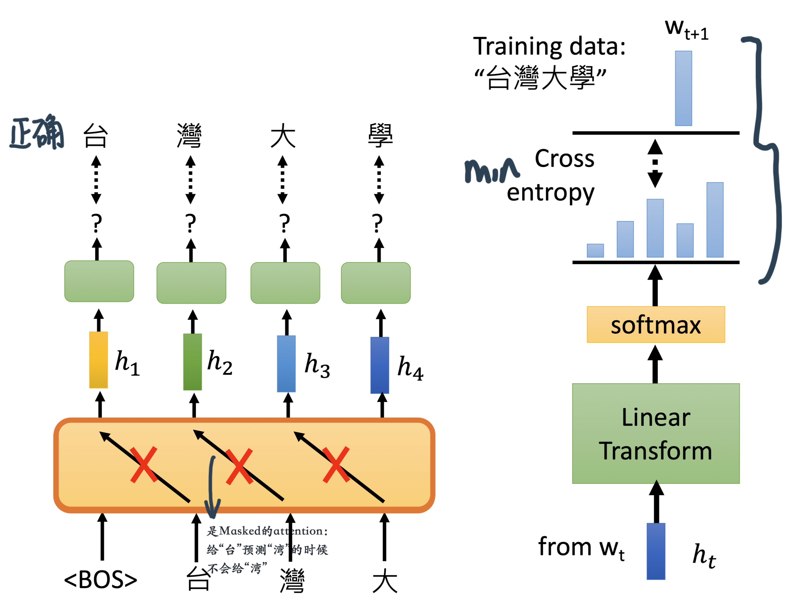

# GPT

### 自回归语言模型（Autoregressive LM, AR）

通常讲的"语言模型"(language model)其实就是根据上文内容预测下一个可能跟随的单词，也就是常说的自左向右的语言模型任务。或者反过来，就是根据下文预测前面的单词(比如ELMO使用了从左到右、从右到左的语言模型)，这种类型的language model被称为**自回归语言模型(AR)**。

ELMO尽管看上去利用了上文、也利用了下文，但是本质上仍然是自回归语言模型。的确，ELMO做了两个方向，但是是分别有两个方向的自回归语言模型，然后把LSTM的两个方向的隐节点状态*拼接* 到一起，来体现双向语言模型这个事情的。（所以说，ELMO是"伪双向"，而BERT是"真双向"）。因为ELMO的这种融合模式过于简单，所以效果其实并不是太好。

GPT也是典型的自回归语言模型。GPT其实就是Transformer的**decoder**部分（其实和transformer的decoder还有些不一样）经过大规模数据预训练之后得到的模型。GPT的"单向"源自于它在Transformer的decoder中用**masked** self-attention来遮挡住了当前词后面的那些词，防止在预测下一个词的时候"看到"下一个词是什么。例如下图中的"it"只能对其之前的token来分配注意力权重。

## **GPT的总体结构：**

做的任务是预测下一个token是什么：

GPT是Transformer Decoder稍加修改、并配以特定的下游模型得到的。"稍加修改"指的是，把用于引入encoder输入的Multi-head Self-Attention砍掉，只保留**Masked** Multi-self Attention和FFN（其实也可以理解为GPT用的是Transformer Encoder，只不过把Multi-head Self Attention 换成了**Masked** Multi-head Self-attention）；"特定下游模型"指的是线性变换+分类这样的简单结构。

**无监督训练**

GPT的无监督预训练是基于语言模型的，给定一个无标签的序列 ，语言模型的优化目标是最大化下面的似然值：

%20%3D%20%5Csum_i%20%5Clog%20P(u_i%20%7C%20u_%7Bi-k%7D%2C%20%5Cdots%2C%20u_%7Bi-1%7D%3B%20%5CTheta)%20%5Ctag1%20) 

其中，网络最后一层的输出概率分布为

**有监督微调**

用预测值和真实的y值计算交叉熵损失 

同时，加入语言模型的loss )作为**auxiliary loss**有助于**①增强泛化能力、同时②提升收敛的速度**。因此完整的损失函数为：

​                                                                        %20%3D%20L_2(%5Cmathcal%7BC%7D)%20%2B%20%5Clambda%20L_1(%5Cmathcal%7BC%7D)%20)

### In-context Learning

GPT目标是一个Few-show learning——给几个examples之后不用gradient descent，甚至one-shot 和 zero-shot