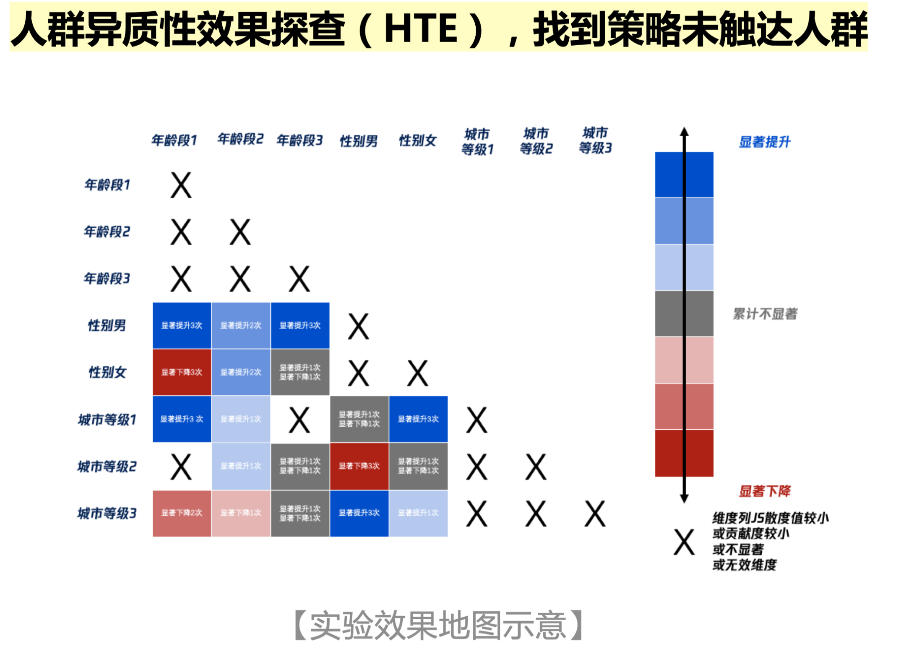

# 数据指标

常见Tradeoff：最大化哪一个：
- 收益ROI = LT × ARPU / CPA
- 规模DAU = DNU × LT + RDAU

## 指标体系

### 视频

指标名
全链路主观打分指标
篇均播放时长 
篇均播放完成次数
篇均完播率 
视频平均时长 
包含话题占比 
篇均分享数
篇均评论数
篇均点赞数
篇均评/赞数
视频平均完播率

## 分析方法

### 指标纵向下钻

可以挖掘出细分的人群

### 指标横向分层

- 基于核心KPI指标：比如低转化率人群、中等、高转化率人群，知道运营动作要对的人
- 基于人群特征：年龄职业等，其实这些对购买习惯也有影响
- 基于场景：比如不同渠道、界面

RFM——对于这些分层方法的一种交叉
