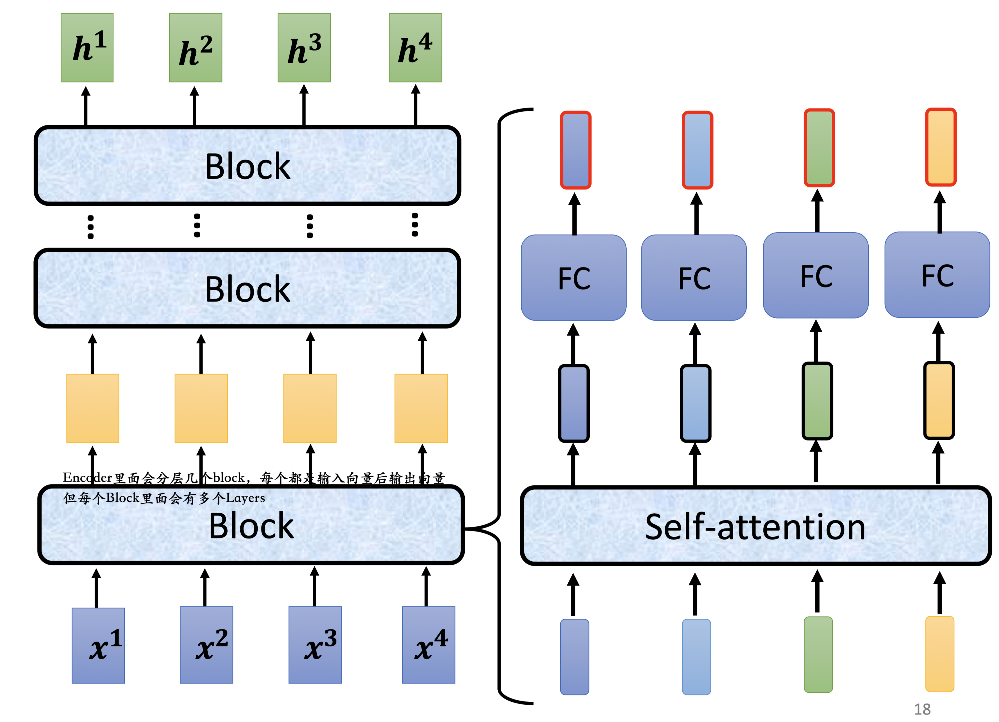
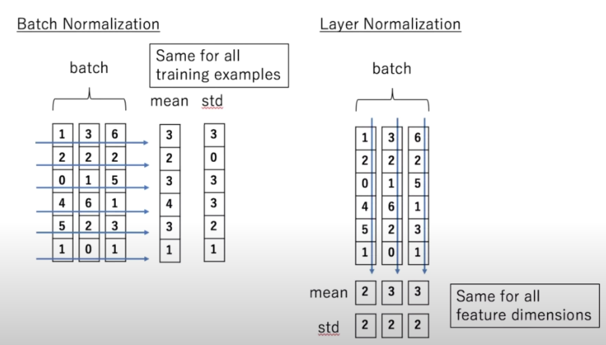
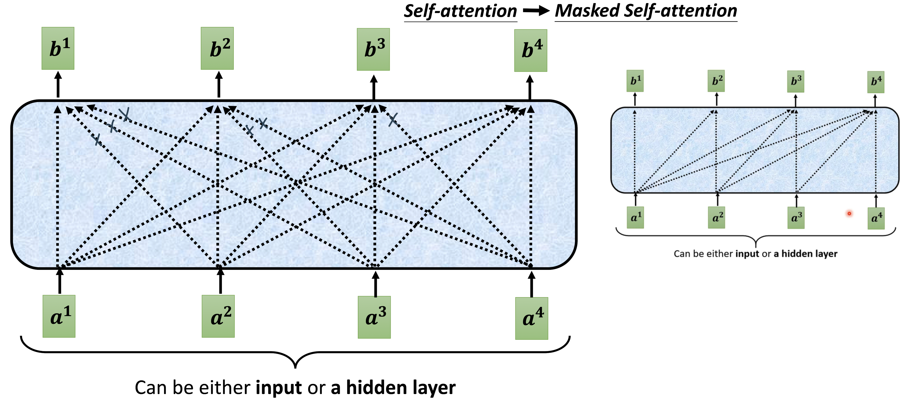
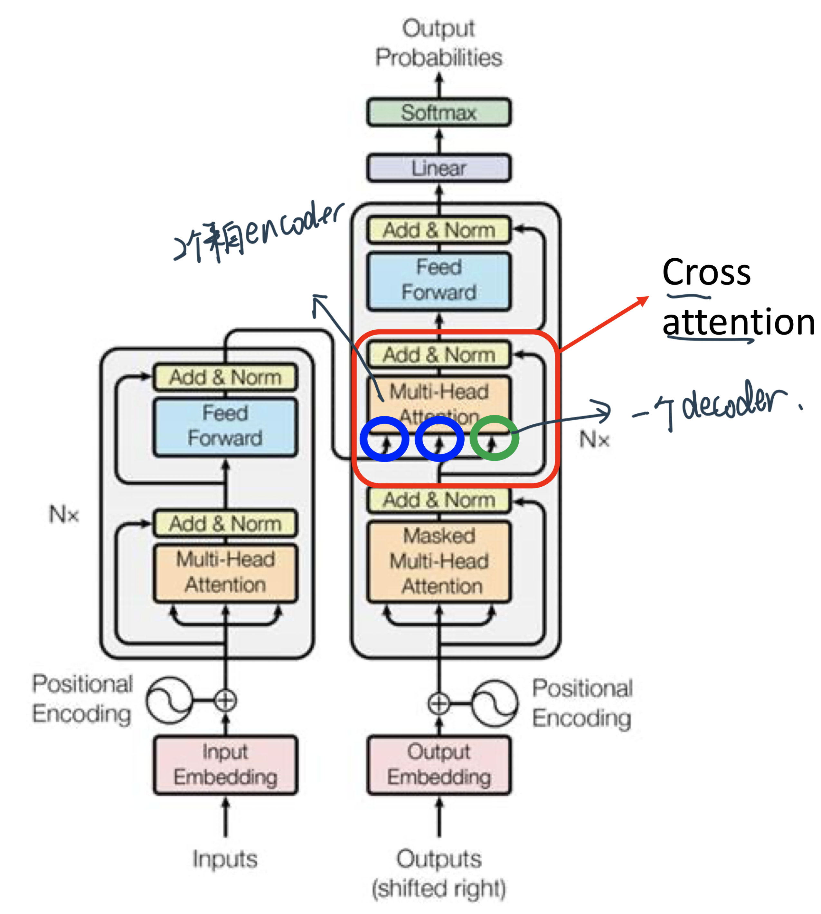
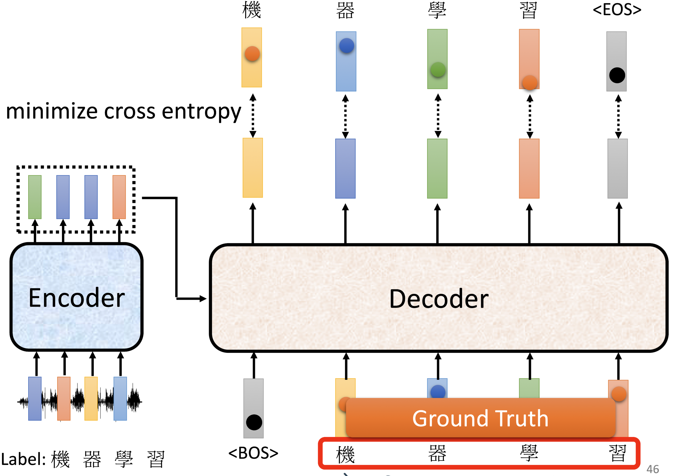

# Transformer

## 引言

RNN: feed forward neural networks rolled out over time, 对input有顺序的很有用！比如Time Series

由于其顺序结构训练速度常常受到限制（precludes parallelization within training examples），而且由于梯度下降/explode，它难以处理长Sequence中较远处的信息。

因此，LSTM中让memory可以retain，但是LSTM比RNN更慢！

 既然Attention模型本身可以看到全局的信息， 那么一个自然的疑问是我们能不能去掉RNN结构，仅仅依赖于Attention模型，这样我们可以使训练并行化，同时拥有全局信息？

你可能听说过不同的著名Transformer模型，如 BERT、GPT。在这篇文章中，我们将精读谷歌的这篇 [Attention is All you need](https://arxiv.org/abs/1706.03762) 论文来回顾一下仅依赖于Self-Attention机制的Transformer架构。

Transformer的优势在于，它可以不受梯度消失的影响，能够保留**任意长**的长期记忆。而RNN的记忆窗口很短；LSTM和GRU虽然解决了一部分梯度消失的问题，但是它们的记忆窗口也是有限的。

> Recurrent neural networks (RNN) are also capable of looking at previous inputs too. But the power of the attention mechanism is that it doesn't suffer from short term memory. RNNs have a shorter window to reference from, so when the story gets longer, RNNs can't access words generated earlier in the sequence. This is still true for Gated Recurrent Units (GRU) and Long-short Term Memory (LSTM) networks, although they do a bigger capacity to achieve longer-term memory, therefore, having a longer window to reference from. The attention mechanism, in theory, and given enough compute resources, have an infinite window to reference from, therefore being capable of using the entire context of the story while generating the text.

## 李宏毅机器学习笔记

### Sequence-to-sequence (Seq2seq)

Transformer是一个`Sequence-to-sequence`会写做`Seq2seq`——input是一个sequence不知道应该要output多长,由机器自己决定output的长度,即Seq2seq

##### 例子

- **语音辨识**:
- **机器翻译**:
- **语音翻译**:
    - 因為**世界上有很多语言,他根本连文字都没有**,所以不能直接先做一个语音辨识,再做一个机器翻译,把语音辨识系统跟机器翻译系统,接起来
    
- **语音合成**
    - 语音辨识反过来就是**语音合成**Text-to-Speech (TTS) Synthesis  
- **聊天机器人**

那事实上Seq2Seq model,在NLP的领域,在natural language processing的领域的使用,是比你想像的更為广泛,其实很多**natural language processing的任务,都可以想成是`question answering,QA`的任务**,而**QA的问题,就可以用Seq2Seq model来解**

- **文法剖析**：Seq2seq for Syntactic Parsing 

    - 给机器一段文字，机器生成的**文法的剖析树**也可以是看做是一个一个Sequence

- multi-label classification

    - **同一个东西,它可以属於多个class**,比如文章分类：

    - 每一篇文章对应的class的数目根本不一样，所以不能直接输出前三名之类的
    - 可以用seq2seq硬做,**输入一篇文章** **输出就是class** 就结束了,机器自己决定 它要输出几个class

- Object Detection

    - 这个看起来跟seq2seq model,应该八竿子打不著的问题,它也可以用seq2seq's model硬解

### Transformer架构

一般的seq2seqmodel会分成两块Encoder和Decoder：input一个sequence有Encoder,负责处理这个sequence,再把处理好的结果丢给Decoder,由Decoder决定,它要输出什麼样的sequence

#### Encoder

seq2seq model `Encoder`要做的事情,就是**给一排向量，输出另外一排向量**

- Transformer中的Block：
    
    核心还是self-attention
    

    1. 注意: 这里做的是Layer Normalization（For a sample, across each feature！）
        

    2. 注意：Transformer的Multi-head内部是把原先的一句$(n个词, 每个词d_{\text {model }}=512维embedding)$的这么个array拆成8个head（而不是同样大小的head做8次：

    $$ \operatorname{MultiHead}(Q, K, V)= \text{Concat} (\operatorname{head}_{1}, \ldots \operatorname{head}_{\mathrm{h}}) W^{O} $$
    where $$head_{\mathrm{i}}=\operatorname{Attention}\left(Q W_{i}^{Q}, K W_{i}^{K}, V W_{i}^{V}\right)$$

    $$\operatorname{Attention}(Q, K, V)=\operatorname{softmax}\left(\frac{Q K^{T}}{\sqrt{d_{k}}}\right) V$$

    - the projections are parameter matrices $W_{i}^{Q} \in \mathbb{R}^{d_{\text {model }} \times d_{k}}, W_{i}^{K} \in \mathbb{R}^{d_{\text {model }} \times d_{k}}, W_{i}^{V} \in \mathbb{R}^{d_{\text {model }} \times d_{v}}$ and $W^{O} \in \mathbb{R}^{h d_{v} \times d_{\text {model }}}$.
    
        In this work we employ $h=8$ parallel attention layers, or heads. For each of these we use $d_{k}=d_{v}=d_{\text {model }} / h=64$. Due to the reduced dimension of each head, the total computational cost is similar to that of single-head attention with full dimensionality.

        也就是说每次headi的$W_{i}^{Q}、W_{i}^{K}、W_{i}^{V}$是分别把一个$(n个词, 每个词d_{\text {model }}=512维embedding)$的句子 给映射到$(n个词, d_{k}=\frac{d_{\text {model }}}{h}=\frac{512}{8}=32维)的array$，最后再concat出来的$\text{Concat} (\operatorname{head}_{1}, \ldots \operatorname{head}_{\mathrm{h}})$才是$(n个词, d_{k} \times h=d_{\text {model}})$维度的array，所以最后$W_O$才会是跟前面不一样的$d_{\text {model }} \times d_{\text {model }}$维度，$W_O$出来的东西就跟原先embeddings的一样了！

整体：
    

注意：**原始论文的设计 不代表它是最好的,最optimal的设计**

- 有一篇文章叫,[on layer normalization in the transformer architecture](https://arxiv.org/abs/2002.04745)，它问的问题就是 為什麼,layer normalization是放在那个地方呢,為什麼我们是先做,residual再做layer normalization,能不能够把layer normalization,放到每一个block的input,也就是说 你做residual以后,再做layer normalization,再加进去 你可以看到说左边这个图,是原始的transformer,右边这个图是稍微把block,更换一下顺序以后的transformer,更换一下顺序以后 结果是会比较好的,这就代表说,原始的transformer 的架构,并不是一个最optimal的设计,你永远可以思考看看,有没有更好的设计方式
- 再来还有一个问题就是,為什麼是layer norm 為什麼是别的,不是别的,為什麼不做batch normalization,也许这篇paper可以回答你的问题,这篇paper是[Power Norm：,Rethinking Batch Normalization In Transformers](https://arxiv.org/abs/2003.07845),它首先告诉你说 為什麼,batch normalization不如,layer normalization,在Transformers裡面為什麼,batch normalization不如,layer normalization,接下来在说,它提出来一个power normalization,一听就是很power的意思,都可以比layer normalization,还要performance差不多或甚至好一点

#### Decoder - AutoRegressive

Decoder整体做的事情是一个一个地输出，也就是auto- regressive（consuming the previously generated symbols as **additional input** when generating the next）

- 里面会有特殊的开始的符号 和 断开的符号，让decoder可以输出“END”的概率，如果最高的话就会停下来！比如OUTPUT：`机 器 学 习 END`

- 解决一步错，步步错的话：可以看scheduled sampling，给模型一些错误的输入

和Encoder的区别在于4个：

1. `Masked Self-attention`: 不能看前面

    

    

    - 原因：现在decoder是一个一个输出，才看得到下一个的

2. 中间加入了一个Cross attention：接下来仔细讲

3. 在结果的地方接了一个Softmax来转换矩阵！

#### Encoder-Decoder
- `Cross attention`:

    

    这个地方比如说 原先input时English的embedding，Decoder来的是French的embedding，这边学习的就是实现English和French的word mapping

    - 输出两个字的过程细节：
        
        

        

- 最后接一个`Linear`：这一层的# Neurons，比如在英语翻译法语的时候数量就会是法语words的个数

- `Softmax`：得到probability

- `Output`：最高的！然后再把这个output shift right传给的coder继续output下一个单词，直到这个步骤输出`End`

### 训练

每次训练其实就类似进行了一个分类问题：目标是minimize总的cross entropy $\mathbb{H}(p)=-\sum_{k} p_{k} \log p_{k}$

- 这里可以做一个`Teacher Forcing`: Ssing the ground truth as input

    

### 评估结果

- BLEU score：decoder出来的句子和ground true对比

### 拓展

- Copy Mechanism: 从输入中复制东西到输出里，如聊天机器人、文章摘要生成
- Guided Attention：要求机器做attention的时候有固定的方式

## Attention Is All You Need读论文笔记

### 1. Introduction

RNN (LSTM)的问题很多，并行计算能力很差，因为 T 时刻的计算依赖 T-1 时刻的隐层计算结果。
- precludes parallelization within training examples, which becomes critical at longer sequence lengths, as memory constraints limit batching across examples

怎么改进也没用，所以我们另起炉灶放弃recurrence，而是relying **entirely on an attention mechanism** to draw global dependencies between input and output

对比RNN系列，Transformer的特征抽取能更好，使用了self-attention和多头机制来让源序列和目标序列自身的embedding表示所蕴含的信息更加丰富。

### 2. Backgound

- `Self-attention` an attention mechanism relating different **positions** of a single sequence in order to compute **a representation of the sequence**

- Transformer特性：rely entirely on self-attention to compute representations of its input and output without using sequence aligned RNNs or convolution

### 3. Model Architecture

#### 总体结构

Transformer的结构采用 Encoder-Decoder 架构。论文中Encoder层由6个Encoder堆叠在一起，Decoder层也是6层。

先从整体来看：

- Encoder将输入序列做了一个复杂的、高阶的embedding；
- Decoder使用了Encoder的这个高阶embedding，同时还根据之前Decoder的输出，一步一步地产生输出。

每一个Encoder和Decoder的内部结构如下图：

- Encoder的每个identical layer里包含两个Sublayers：

    - 多头Self-attention层，帮助当前节点不仅仅只关注当前的词，从而能获取到上下文的语义。

    - 前馈神经网络层(feed forward)，提供非线性。

- Decoder里面有三个sublayer

    - masked Self-attention 保证不看到后面的序列

    - 跟encoder交叉的multi-head attention

    - FC

#### Encoder层

首先，模型需要对输入的数据进行一个embedding操作，并输入到Self-attention层，处理完数据后把数据送给前馈神经网络，前馈神经网络的计算可以并行，得到的输出会输入到下一个Encoder。大致结构如下：

就是embedding， 是经过self-attention之后的输出， 是经过feed forward网络之后的输出，它们会被输入到下一层encoder中去。

##### Embedding层

Transformer模型中缺少一种解释输入序列中单词**顺序**的方法。为了处理这个问题，Transformer给Encoder层和Decoder层的输入添加了一个额外的向量Positional Encoding，维度和embedding的维度一样。

这个位置向量的具体计算方法有很多种，论文中的计算方法是在偶数位置，使用正弦编码，在奇数位置，使用余弦编码：

$$\begin{aligned} P E_{(p o s, 2 i)} &=\sin \left(p o s / 10000^{2 i / d_{\mathrm{model}}}\right) \\ P E_{(p o s, 2 i+1)} &=\cos \left(p o s / 10000^{2 i / d_{\mathrm{model}}}\right) \end{aligned}$$

- pos: 当前词在句子中的位置
- i：是指向量中每个值的 index

  (实际上 用any reasonable function应该都可以！)

所以，最终一个词的embedding，就是它的语义信息embedding+序列信息embedding (positional encoding):

##### Self-attention层

让我们从宏观视角看自注意力机制，精炼一下它的工作原理。

例如，下列句子是我们想要翻译的输入句子：

> The animal didn't cross the street because it was too tired.

​    这个“it”在这个句子是指什么呢？它指的是street还是这个animal呢？这对于人类来说是一个简单的问题，但是对于算法则不是。

​    当模型处理这个单词“it”的时候，自注意力机制会允许“it”与“animal”建立联系。

​    随着模型处理输入序列的每个单词，自注意力会关注整个输入序列的**所有单词**，帮助模型对本单词更好地进行编码(embedding)。

​    如上图所示，当我们在编码器#5（栈中最上层编码器）中编码“it”这个单词的时，注意力机制的部分会去关注“The Animal”，将它的表示的一部分编入“it”的编码中。接下来我们看一下Self-Attention详细的处理过程。

- **step 1**：对于输入序列的每个单词，它都有三个向量编码，分别为：$Query、Key、Value$。这三个向量是用embedding向量与三个矩阵（ $W^Q, W^K, W^V$ )相乘得到的结果。这三个矩阵的值在BP的过程中会一直进行更新。

- **step 2**：计算Self-Attention的分数值，该分数值决定了当我们在某个位置encode一个词时，对输入句子的其他部分的关注程度。这个分数值的计算方法是用该词语的$Query$与句子中其他词语的$Key$做点乘。以下图为例，假设我们在为这个例子中的第一个词“Thinking”计算自注意力向量，我们需要拿输入句子中的每个单词对“Thinking”打分。这些分数决定了在编码单词“Thinking”的过程中重视句子其它token的程度。

    

- **step 3**：对每个分数除以 $\sqrt{d}$ （d是embedding维度），之后做softmax进行归一化。

    

    注意！这里是跟Self- attention不同的地方，除这个d的原因是：
    > Transformer在对比dot product和additive（element wise相加）的时候，发现后者的效果更好！We suspect that for large values of $d_{k}$, the dot products grow large in magnitude, pushing the softmax function into regions where it has extremely small gradients. To counteract this effect, we scale the dot products by $\frac{1}{\sqrt{d_{k}}}$. （$d_{k}$是embedding的维度）。

- **step 4**：把每个$Value$向量和softmax得到的权重值进行相乘，进行加权求和，得到的结果即是一个词语的self-attention embedding值。这个embedding值已经是融合了句子中其他token的了。

    

这样，自注意力的计算就完成了。得到的向量就可以传递给前馈神经网络。

值得注意的是，这个地方的self-attention是可以并行化进行的！

##### Multi-Headed Attention

​    通过增加一种叫做"多头"注意力（"multi-headed"attention）的机制，论文进一步完善了自注意力层。

​    接下来我们将看到，对于“多头”注意力机制，我们有多个Query/Key/Value权重矩阵集  (Transformer使用八个注意力头)。

​    现在对于每一个词语，我们有了八个向量 ，它们分别由八个head产生。但是对于下一个feed-forward层，我们应该把每个词语都用一个向量来表示。所以下一步，我们需要把这八个向量压缩成一个向量。可以直接把这些矩阵拼接在一起，然后用一个附加的权重矩阵$W^O$与它们相乘:

  
那么，**Transformer为什么需要进行Multi-head Attention**：原因是将模型分为多个头，形成多个子空间，可以让模型去关注不同方面的信息，最后再将各个方面的信息综合起来。多次attention综合的结果至少能够起到增强模型的作用，可以类比CNN中同时使用多个卷积核的作用，直观上讲，多头的注意力有助于网络捕捉到更丰富的特征/信息。

##### The Residuals and Layer normalization

​    在继续进行下去之前，我们需要提到一个encoder中的细节：在每个encoder中都有一个残差连接，并且都跟随着一个Layer Normalization（层-归一化）步骤。

 

Layer-Norm也是归一化数据的一种方式，不过 Layer-Norm 是在**每一个样本上**计算均值和方差，而不是 Batch-Norm 那种在**批**方向计算均值和方差！

总而言之，Encoder就是用来给input一个比较好的embedding，使用self-attention来使一个词的embedding包含了**上下文**的信息，而不是简单的查look-up table。Transformer使用了多层(6层)的Encoder是为了把握一些**高阶**的信息。

### Decoder层

Transformer的Decoder作用和普通seq2seq一样：从\<Start\>开始，基于**之前的Decoder输出**，以及**Encoder的embedding**，来预测**下一个词的概率分布**。

下面我们来详细介绍Decoder的内部结构。

#### Output的embedding

和Encoder一样，Decoder中的Output先经过embedding变成数字向量然后+positional encoding之后得到了一个embedding

#### Masked Multi-Head Attention

和前面不同的是，Decoder的self-attention层其实是**masked** multi-head attention。mask表示掩码，它对某些值进行掩盖。这是为了防止Decoder在计算某个词的attention权重时“看到”这个词后面的词语。

> Since the decoder is **auto-regressive** and generates the sequence word by word, you need to prevent it from conditioning to future tokens. For example, when computing attention scores on the word "am", you should not have access to the word "fine", because that word is a future word that was generated after. **The word "am" should only have access to itself and the words before it**. This is true for all other words, where they can only attend to previous words.

Mask 是为了使得 decoder 不能看见未来的信息。也就是对于一个序列，在 time_step 为 t 的时刻，我们的Decoder只能依赖于 t 时刻之前的输出，而不能依赖 t 之后的输出。因此我们需要想一个办法，把 t 之后的信息给隐藏起来。

那么具体怎么做呢？也很简单：产生一个上三角矩阵，上三角的值全为-inf。

加上-inf的目的是，做softmax之后-inf会变成0：

这个mask是Decoder中self-attention和Encoder中的self-attention唯一有区别的地方。  经过了masked self-attention之后，decoder的每一个词都得到了**包含其以前信息的高阶融合embedding**。

#### 第二个Multi-head Attention

> For this layer, the encoder's outputs are keys and values, and the first multi-headed attention layer outputs are the queries. This process matches the encoder's input to the decoder's input, allowing the decoder to decide which encoder input is relevant to put a focus on.

每个decoder的masked self-attention输出的token embedding都去和encoder输出的高阶融合embedding做self-attention：

